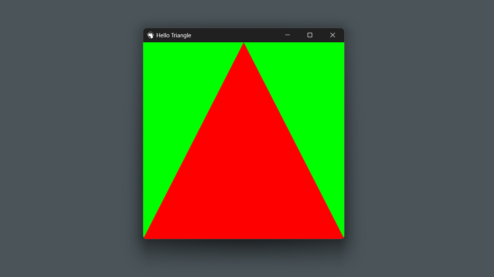

# deno_winit

Winit bindings for Deno.



## How to run

Run the `hello_triangle` example:

```bash
deno task hello_triangle
```

## How to run using local `winit` library

Build `winit` library:

```bash
cargo build --release
```

Run the `hello_triangle_local` example:

```bash
deno task hello_triangle_local
```
